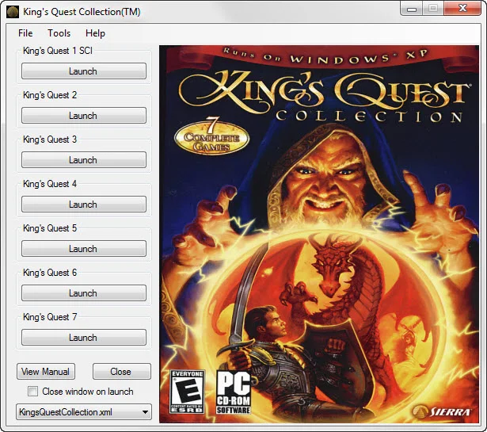
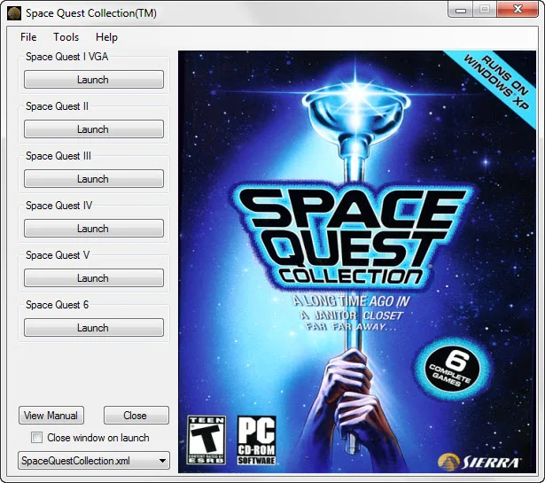
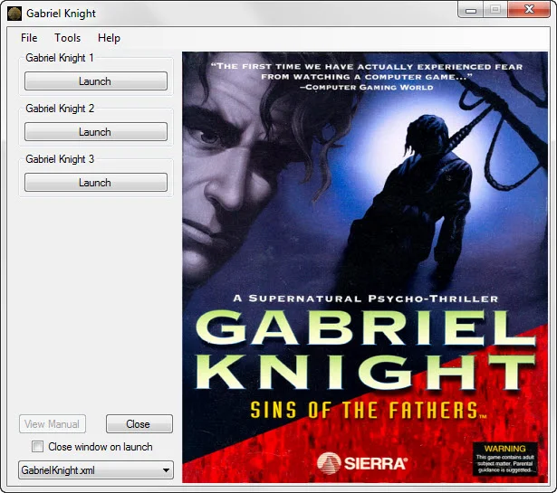
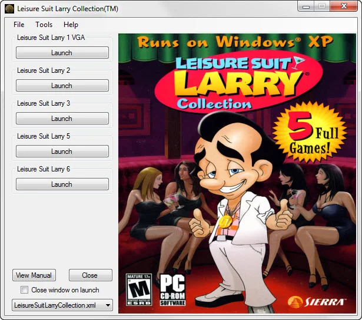
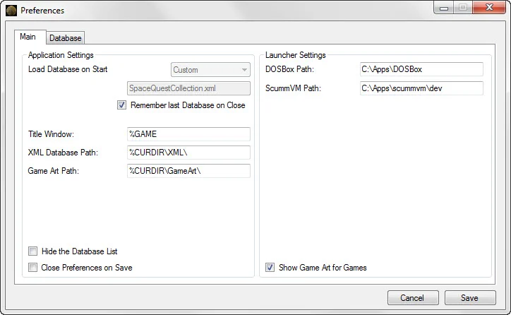
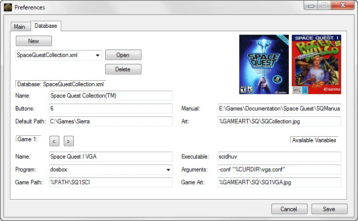

<p align="center">
  
</p>

# Sierra Classics Launcher

A customizable launcher for classic Sierra games (King's Quest, Space Quest, Leisure Suit Larry, Police Quest, Quest for Glory, and more).

## Download

**[Download Latest Release](../../releases/latest)**

| Platform | Download |
|----------|----------|
| Windows | `.zip` |

## Features

- Launch games via DOSBox, ScummVM, or custom programs
- Build game collection databases with up to 7 games each
- Display game artwork with hover preview
- XML-based configuration for portable use

## Screenshots

| King's Quest Collection | Space Quest Collection |
|:-:|:-:|
|  |  |

| Gabriel Knight | Leisure Suit Larry Collection |
|:-:|:-:|
|  |  |

| Preferences - Main | Preferences - Database |
|:-:|:-:|
|  |  |

## Requirements

- Windows with .NET Framework 2.0 or higher
- [DOSBox](https://www.dosbox.com/) and/or [ScummVM](https://www.scummvm.org/) installed
- Your Sierra game files

## Configuration

The launcher uses XML files for configuration:

- `config.xml` - Application settings (paths to DOSBox/ScummVM, preferences)
- `XML/*.xml` - Game database files (one per collection)
- `GameArt/` - Artwork images for your games

### Path Placeholders

Use these in your XML files:
- `%CURDIR` - Application directory
- `%PATH` - Default game path (from database)
- `%GAMEART` - Game artwork directory

## Building from Source

Built with VB.NET Windows Forms. Open the solution file in Visual Studio:

```
src/Sierra Classics Launcher.sln
```

## History

Originally created in June 2007 as a replacement for the launcher included with Vivendi's 2006 Sierra collections.

### Version History

#### 1.0.0.20 (July 2013)
- Updated Program Logo and About information

#### 1.0.0.19 (August 2012)
- Changed ScummVM launch process
- Added ability to use any application in Program field
- Added Open menu item for opening databases

#### 1.0.0.18 (July 2012)
- Added checkbox for remembering last opened database
- Recoded launching of applications

See [docs/CHANGELOG.md](docs/CHANGELOG.md) for the full version history.

## License

See [LICENSE](LICENSE) file.
